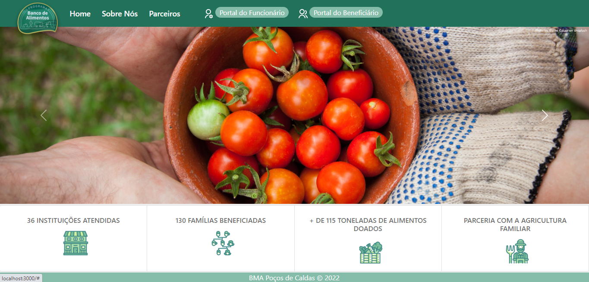
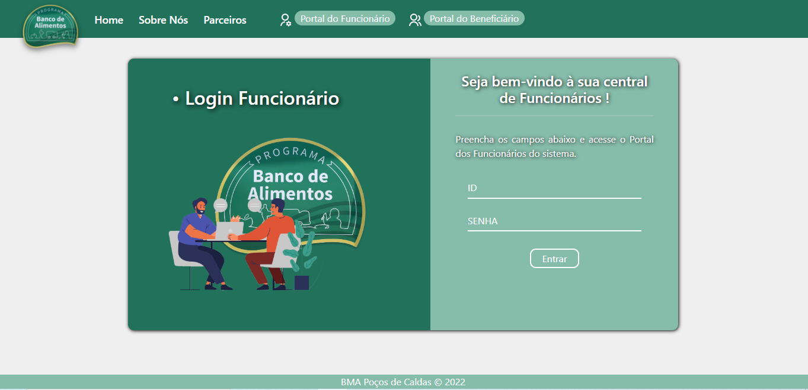
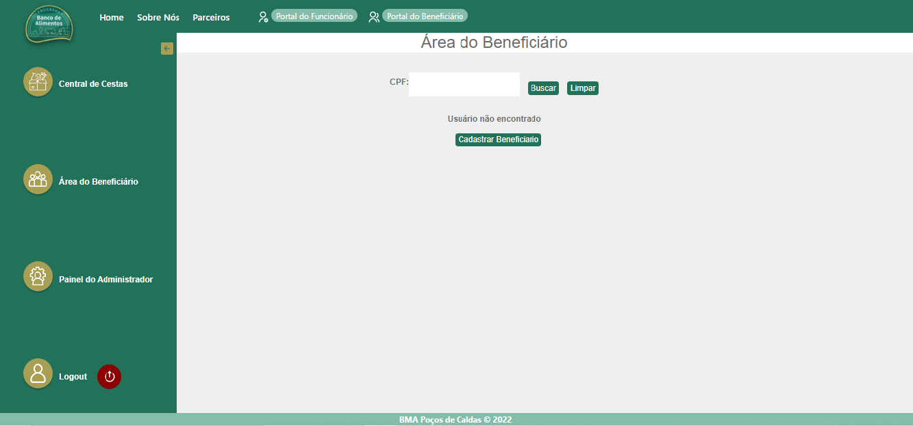
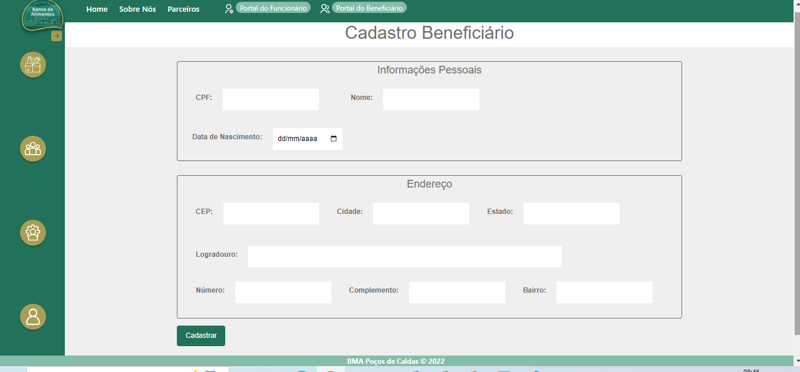
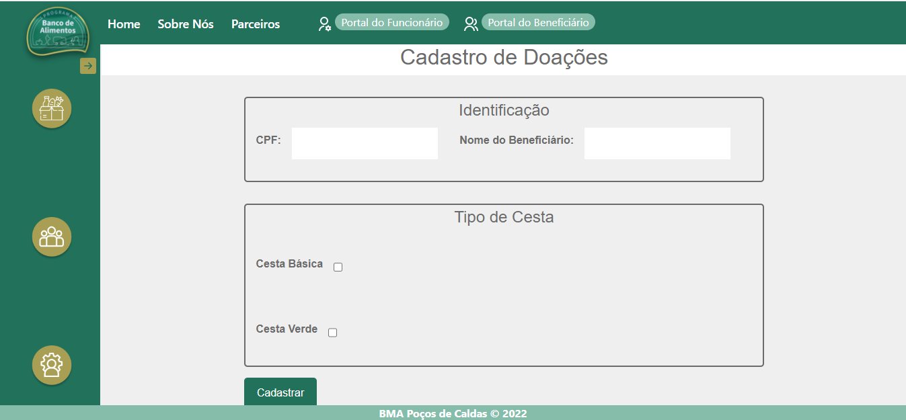
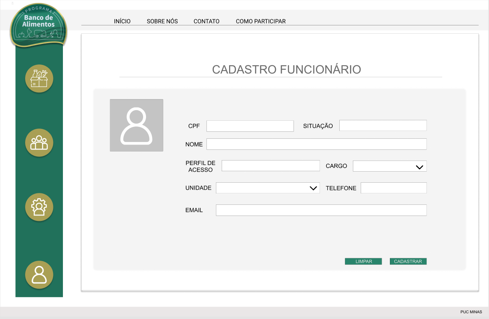
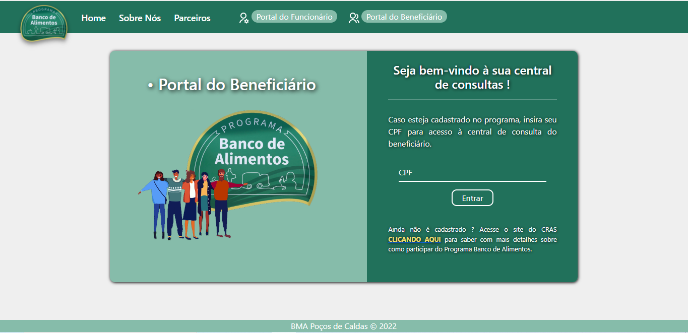
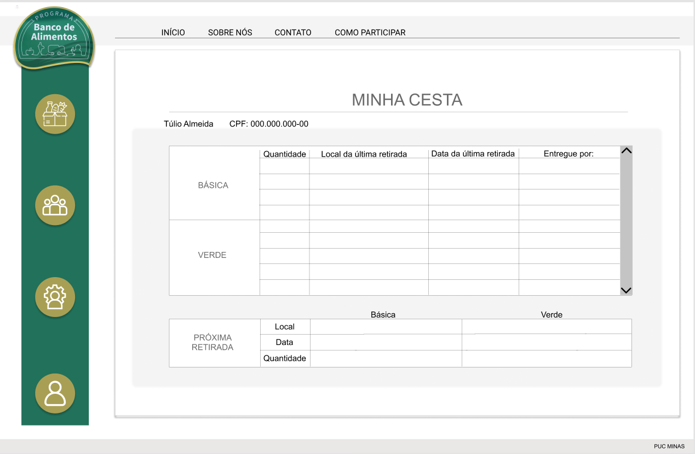

# Projeto de Interface

Está single page foi projetada mantendo a identidade visual do Banco de Alimentos de Poços de Caldas com intuito de funcionamento em desktops, com foco na acessibilidade, agilidade e usabilidade.

Nesta single page há um Navbar onde é possível que o usuário navegue em:

* Sobre Nós: onde é apresentado um pouco da história do Banco De Alimentos de Poços de Caldas. 

* Parceiros: onde é encontrado informações sobre os Parceiros que contribuem com as doações do projeto social. 

* Portal do Funcionário/Administrador: onde somente os administradores munidos de login e senha possam cadastrar/excluir/alterar beneficiários e funcionários, bem como cadastrar as doações de cestas. 

* Portal do Beneficiário: onde os beneficiários cadastrados realizam login com seu CPF para consultar o histórico de cestas retirados por ele, bem como a data de sua próxima retirada de cestas.

## Diagrama de Fluxo

O diagrama apresenta o estudo do fluxo de interação do usuário com o sistema interativo.

## Wireframes

## Home- Page: A tela Home apresenta opções de Navegação em Sobre Nós, Parceiros, Portal do Funcionário e Beneficiário.

## Painel Administrador: Permite o acesso pelos administradores/funcionários ao Cadastro de Beneficiários, Cadastro de Doações e Cadastro de Funcionários.

## Portal do Beneficiário: Permite acesso ao usuário externo (Beneficiário das Cestas) através do CPF, consultar a data das próximas cestas e  histórico de cestas retiradas.

