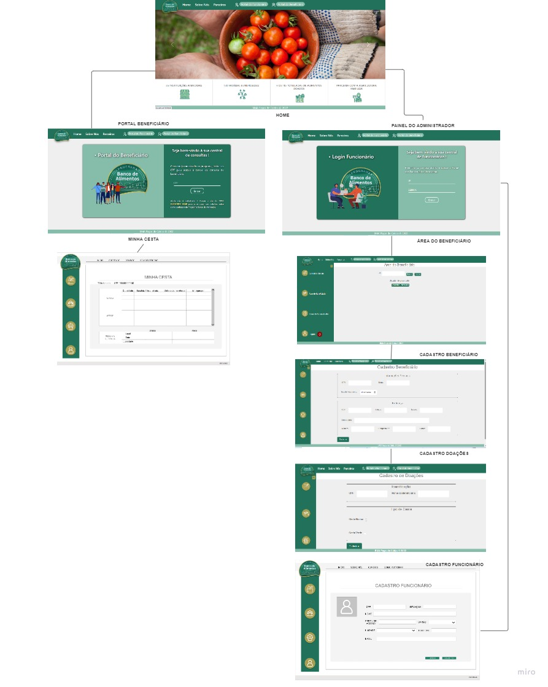

# Projeto de Interface

Nesta single page há um Navbar onde é possível que o usuário navegue em:

* Sobre Nós: onde é apresentado um pouco da história do Banco De Alimentos de poços de caldas. 

* Parceiros: onde é encontrado informações sobre os Parceiros que contribuem com as doações do projeto social. 

* Portal do Funcionário/Administrador: onde somente os administradores munidos de login e senha possam cadastrar/excluir/alterar beneficiários e funcionários, bem como cadastrar as doações de cestas. 

* Portal do Beneficiário: onde os beneficiários cadastrados realizam login com seu CPF para consultar o histórico de cestas retirados por ele, bem como a data de sua próxima retirada de cestas.

## Diagrama de Fluxo

O diagrama apresenta o estudo do fluxo de interação do usuário com o sistema interativo.

## Wireframes

