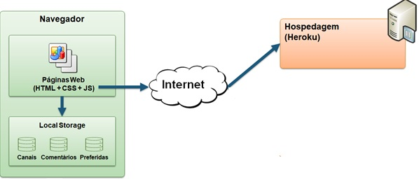
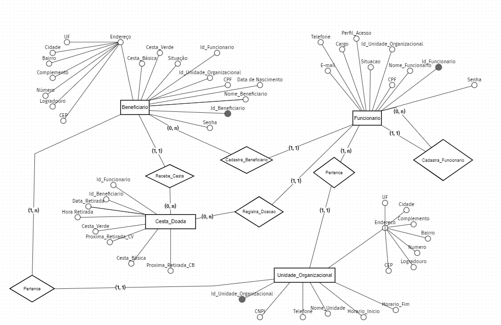
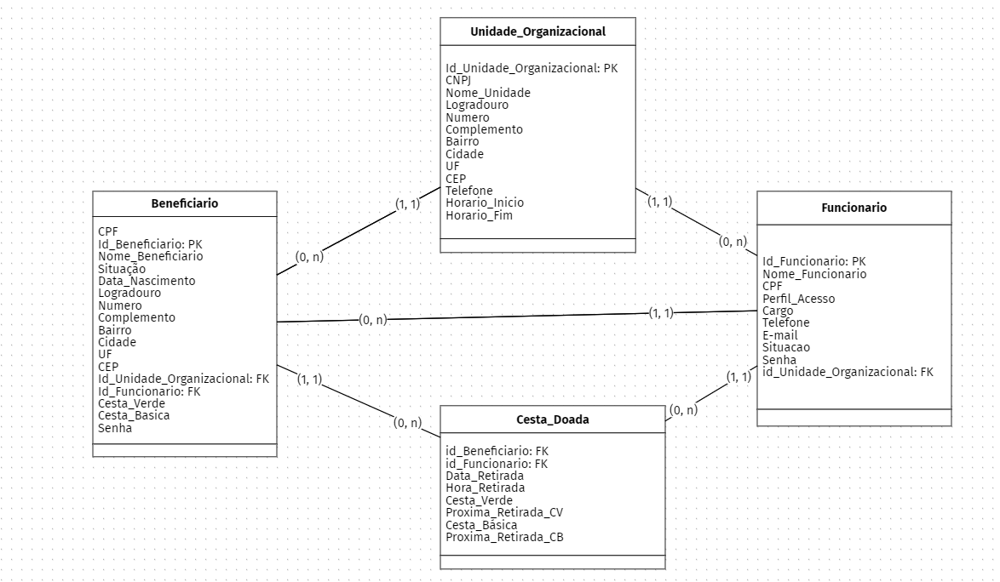
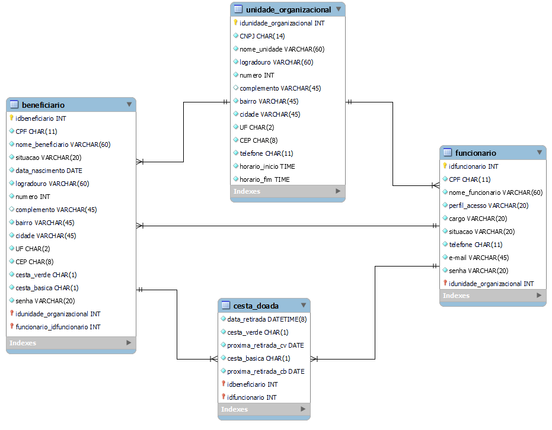

# Arquitetura da Solução

O referido projeto foi estruturado com o auxílio de algumas ferramentas essenciais para a obtenção de resultados satisfatórios. 

Para o desenvolvimento em HTML5, CSS3 e Javascript, está sendo utilizado o editor de código Visual Studio Code.

Para a comunicação entre os participantes do grupo, o Microsoft Teams tem sido usado como canal de comunicação oficial e o Whatsapp como canal de comunicação informal, nos quais ocorre o compartilhamento de materiais e agendamentos de dailys. 

Para a prototipação de interfaces, utilizamos o Figma. A arquitetura foi elaborada com o Miro. 

Como sistema de gerenciamento de banco de dados, está sendo utilizado o MySQL.

Como hospedagem do projeto será utilizado Heroku. E, para o gerenciamento e versionamento do projeto, utilizamos o GitHub.

## Diagrama de componentes

Diagrama que permite a modelagem física de um sistema, através da visão dos seus componentes e relacionamentos entre os mesmos.

Os componentes que fazem parte da solução atendem a estrutura do diagrama abaixo: 

Figura 01 - Arquitetura da Solução

A solução implementada conta com os seguintes módulos:
- **Navegador** - Interface básica do sistema  
  - **Páginas Web** - Conjunto de arquivos HTML, CSS, JavaScript e imagens que implementam as funcionalidades do sistema.
   - **Local Storage** - armazenamento mantido no Navegador, onde são implementados bancos de dados baseados em JSON. São eles: 
     - **Canais** - seções de notícias apresentadas 
     - **Comentários** - registro de opiniões dos usuários sobre as notícias
     - **Preferidas** - lista de notícias mantidas para leitura e acesso posterior
 - **Hospedagem** - local na Internet onde as páginas são mantidas e acessadas pelo navegador. 

## REGRAS DE NEGÓCIO

As regras de negócio observadas para essa etapa são:

- Um funcionário registra a distribuição de cestas básicas/verdes para um beneficiário;
- Um funcionário pode registrar várias distribuições de cestas básicas/verdes para um beneficiário desde que se respeite o período mínimo de cada cesta (verde: 15 dias; básica: 30 dias);
- Um funcionário pode cadastrar vários beneficiários; 
- Um funcionário com nível de acesso de administrador realiza o cadastro de outros funcionários;  
- Um funcionário está vinculado à uma unidade organizacional;
- Um beneficiário visualiza dados do seu histórico de recebimento de cestas básicas e/ou cestas verdes. 
- Um beneficiário recebe cestas verdes e/ou básicas no local pré-definido respeitando as frequências mínimas (verde: 15 dias; básica: 30 dias).
- O beneficiário é vinculado a uma Unidade Organizacional para retirar sua cesta. 

## IDENTIFICAÇÃO DE ENTIDADES

Foram idenficadas as seguintes entidades:

- Funcionário 
- Beneficiário 
- Cesta_Doada
- Unidade Organizacional

## IDENTIFICAÇÃO DE RELACIONAMENTOS

No projeto atual foram identificados os relacionamentos que se seguem: 

- Funcionário cadastra Beneficiário;
- Funcionário (Perfil Administrador) cadastra Funcionário; 
- Funcionário registra Cesta Doada; 
- Beneficiário recebe Cesta Doação; 
- Funcionário pertence a Unidade Organizacional;
- Beneciário pertence a Unidade Organizacional.

## IDENTIFICAÇÃO DE ATRIBUTOS

A seguir são apresentadas os atributos identificados para cada entidade:

- **Funcionário** 
   - Id_Funcionario
   - CPF
   - Nome_Funcionario
   - Situação 
   - Perfil de Acesso 
   - Cargo 
   - Telefone
   - E-mail
   - Senha
   - Id_Unidade Organizacional

- **Beneficiário** 
   - Id_Beneficiario
   - CPF
   - Nome_Beneficiario
   - Situacao
   - Data_Nascimento
   - Endereço
     - CEP
     - Logradouro
     - Número
     - Complemento
     - Bairro
     - Cidade
     - UF
   - Senha
   - Cesta_Basica
   - Cesta_Verde
   - Id_Unidade_Organizacional
   - Id_Funcionario

- **Cesta_Doada** 
   - Id_Beneficiário
   - Id_Funcionario
   - Data_Retirada
   - Hora_Retirada
   - Cesta_Verde
   - Proxima_Retirada_CV
   - Cesta_Básica
   - Proxima_Retirada_CB

- **Unidade Organizacional** 
   - Id_Unidade_Organizacional 
   - CNPJ
   - Nome_Unidade
   - Endereço
     - CEP
     - Logradouro
     - Número
     - Complemento
     - Bairro
     - Cidade
     - UF
   - Horario_Funcionamento_Inicio
   - Horario_Funcionamento_Fim
   - Telefone

## Tecnologias Utilizadas

As ferramentas que serão utilizadas no desenvolvimento de software são: 
 - Desenho de protótipo: Figma
 - Desenvolvimento front-end e back-end: Visual Studio Code, html, css, java script;  
 - Modelagem de Dados: MySQL e BR Modelo Web; 
 - Hoespedagem: Heroku;
 - Comunicação equipe: Whatsapp, Microsoft Teams;
 - Versionamento de Código: Git e Github;
 - Planejamento: Medologia Scrum, Quadro Kanban. 

## Hospedagem

A hospedagem do projeto será realizada na plataforma Heroku. Nessa plataforma é possível realizar, além da hospedagem, os testes, configurações e publicações virtuais na núvem. Essa ferramenta auxiliará na implementação da aplicação de forma mais otimizada e segura. 

## Diagrama de Classes

O diagrama de classes do projeto pode ser visualizado na imagem a seguir.

## Modelo ER

O Modelo ER representa através de um diagrama como as entidades (coisas, objetos) se relacionam entre si na aplicação interativa.

## Esquema Relacional

O Esquema Relacional corresponde à representação dos dados em tabelas juntamente com as restrições de integridade e chave primária.

 

## Modelo Físico (DDL)

O arquivo relacionado ao modelo físico se encontra em: 

https://github.com/ICEI-PUC-Minas-PMV-SInt/pmv-sint-2022-2-e3-proj-back-t1-time-2-bma/tree/main/src

## Instruções SQL de Manipulação do BD (DML)

O arquivo relacionado ao as instruções SQL de Manipulação de BD se encontra em: 

https://github.com/ICEI-PUC-Minas-PMV-SInt/pmv-sint-2022-2-e3-proj-back-t1-time-2-bma/tree/main/src

