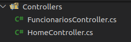
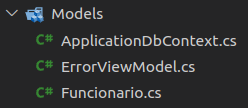
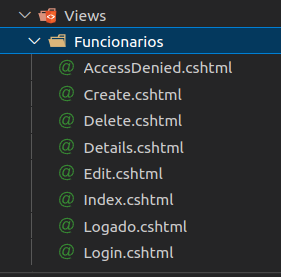

# Programação de Funcionalidades

Na elaboração do projeto para esta etapa, a aplicação web do Banco Municipal de Alimentos será estruturada no padrão MVC usando a plataforma Asp.NET Core. A aplicação será desenvolvida com base no princípio de separação de interesses, a qual será dividida em três camadas: Model, Controller e View. Assegurando assim, o baixo acoplamento e facilidade dos testes, no processo de desenvolvimento da aplicação. 
Os frameworks utilizados na criação do sistema, serviram como ferramentas para estruturação e configuração do projeto, além de trazer um padrão de código mais limpo e seguro. O uso desses frameworks garantiram maior clareza de entendimento, facilitando assim o avanço no desenvolvimento do nosso projeto. 
Uma das desvantagens da utilização, é a complexidade de configuração. Isso pode gerar dificuldade na implementação e conflito na comunicação com outras partes do sistema que estamos desenvolvendo.

Na terceira etapa do projeto desenvolvemos as telas do sistema conforme os requisitos funcionais RF-01 a RF-009. As telas desenvolvidas, bem como cada integrante responsável são descritas no quadro a seguir. 

|Requisito | Descrição do Requisito  | Nome da Tela| Responsável|
|:------:|:-----------------------------------------:|:----:|:-----:|
|RF-001| Permitir que o usuário faça login de entrada| Login| Elaine|
|RF-002| Permitir que o usuário faça logoff do sistema| Login | Elaine|
|RF-003| Permitir que o administrador cadastre os usuários do sistema| Cadastro Funcionário |Amanda|
|RF-004| Permitir que o administrador consulte, altere e exclua o cadastro dos usuários do sistema| Cadastro Funcionário|Amanda|
|RF-005| Permitir que o usuário cadastre os beneficiários| Cadastro de Beneficiário|Adriana|
|RF-006| Permitir que o usuário consulte, altere e exclua o cadastro dos beneficiários| Cadastro de Beneficiário|Adriana|
|RF-007| Permitir que o usuário registre as retiradas de cestas pelo beneficiário| Cadastro Doações|Dayana
|RF-008| Restringir a retirada de cesta, conforme periodicidade estabelecida pelo município| Cadastro Doações|Dayana|
|RF-009| Permitir que o usuário visualize histórico de retirada dos beneficiários| Cadastro Doações|Dayana|

Navegação pelas funcionalidade de acordo com o perfil de acesso do usuário :

|Requisito | Funcionalidade | Perfil|
|:------:|:----:|:-----:|
|RF-001|  Login| Admin, User|
|RF-002|  Login | Admin, User|
|RF-003|  Cadastro Funcionário |Admin|
|RF-004|  Cadastro Funcionário|Admin|
|RF-005|  Cadastro de Beneficiário|Admin|
|RF-006|  Cadastro de Beneficiário|Admin|
|RF-007|  Cadastro Doações|Admin, User|
|RF-008|  Cadastro Doações|Admin, User|
|RF-009|  Cadastro Doações|Admin,User|

# Login
**Estrutura**

Na camada Controller, que será responsável pelo gerenciamento das requisições do sistema, temos a classe FuncionariosController.cs. Nela está inserido o código CRUD, como também o de validação de usuário, implementada de acordo com o perfil de acesso. Esssa validação ocorre através de senha, que está protegida por uma função hash, garantindo assim a segurança dos dados.

Código fonte presente no FuncionariosController.cs, com validação por meio de Cpf e Senha do usuário. Onde também é implementado a navegação de acordo com perfil do usuário no sistema:

            [Authorize]
    public class FuncionariosController : Controller
    {
        private readonly ApplicationDbContext _context;

        public FuncionariosController(ApplicationDbContext context)
        {
            _context = context;
        }
        [AllowAnonymous]
        public IActionResult Login()
        {
            return View();
        }

        [HttpPost]
        [AllowAnonymous]
        public async Task<IActionResult> Login([Bind("Cpf,Senha")] Funcionario funcionario)
        {
            var user = await _context.Funcionarios
              .FirstOrDefaultAsync(m => m.Cpf == funcionario.Cpf);

            if (user == null)
            {
                ViewBag.Message = "Usuário e/ou Senha inválidos!";
                return View();
            }

            bool senhaOk = BCrypt.Net.BCrypt.Verify(funcionario.Senha, user.Senha);

            if (senhaOk)
            {
                var claims = new List<Claim>
                {
                  new Claim (ClaimTypes.Name, user.Nome),
                  new Claim (ClaimTypes.NameIdentifier, user.Nome),
                  new Claim (ClaimTypes.Role, user.Perfil_acesso.ToString())
                };

                var userIdentity = new ClaimsIdentity(claims, "login");

                ClaimsPrincipal principal = new ClaimsPrincipal(userIdentity);

                var props = new AuthenticationProperties
                {
                    AllowRefresh = true,
                    ExpiresUtc = DateTime.Now.ToLocalTime().AddDays(1),
                    IsPersistent = true,

                };

                await HttpContext.SignInAsync(principal, props);

                return Redirect("Logado");

            }

Para facilitar o processo de revisão do código, adota-se a convenção de nomeclatura na escrita da aplicação, como visto no código acima. Como padrão utilizamos camelCase para variáveis e PascalCase para métodos. Já a indentação, com um padrão BSD, auxilia na estruturação do programa.  

Para a camada Model geramos o ApplicationDbContext.cs, uma classe de contexto para configurar o banco de dados. Na classe Funcionario.cs, aplica-se a configuração dos modelos do banco de dados dos usuários, com a tabela (Funcionario) e seus atributos. Nessa camada, a lógica de negócio é executada ocorrendo a persistência do estado e dos dados no sistema.

Código fonte presente na classe Funcionario.cs:

    [Table("Funcionario")]
    public class Funcionario
    {
        [Key]
        public int Id { get; set; }

        [Required(ErrorMessage = "Campo obrigatório!")]
        public string Nome { get; set; }

        [Required(ErrorMessage = "Campo obrigatório!")]
        public string Cpf { get; set; }

        [Required(ErrorMessage = "Campo obrigatório!")]
        public string Data_nascimento { get; set; }

        [Required]
        public string Email { get; set; }

        [Required(ErrorMessage = "Campo obrigatório!")]
        public string Telefone { get; set; }

        [Required(ErrorMessage = "Campo obrigatório!")]
        public string Cep { get; set; }

        [Required(ErrorMessage = "Campo obrigatório!")]
        public string Logradouro { get; set; }

        [Required(ErrorMessage = "Campo obrigatório!")]
        public string Numero { get; set; }

        public string Complemento { get; set; }

        [Required(ErrorMessage = "Campo obrigatório!")]
        public string Bairro { get; set; }

        [Required(ErrorMessage = "Campo obrigatório!")]
        public string Cidade { get; set; }

        [Required(ErrorMessage = "Campo obrigatório!")]
        public string Uf { get; set; }

        public string Situacao { get; set; }

        [Required(ErrorMessage = "Campo obrigatório!")]
        public Perfil Perfil_acesso { get; set; }

        [Required(ErrorMessage = "Campo obrigatório!")]
        [DataType(DataType.Password)]
        public string Senha { get; set; }
    }
    public enum Perfil
    {
        Admin,
        User
    }

Já na camada View responsável pela exibição do conteúdo da Interface do usuário, encontram-se os arquivos da Home da aplicação, Login.cshtml, AccessDenied.cshtml e Logado.cshtml. Nesse último está inserido um menu para navegação e acesso a inserção, edição e exclusão de cadastros, mas que se limita ao perfil permitido(Admin). Outras funcionalidades que poderão ser acessadas pelo menu, são de cadastro e histórico de retirada de cestas. Essas opções estarão disponíveis a todos usuários pertinentes no sistema (Admin e User). Nessa camada os artefatos gerados são arquivos de marcação de texto, HTML. Nela ocorre o envio e a renderização das informações para o modelo através do controle. 

Tela final da sessão de Login do Usuário:

As telas desenvolvidas pelas integrantes do grupo podem ser visualizadas nos vídeos a seguir:

# Cadastro de Beneficiário
1. Tela de Cadastro de Beneficiário.

https://user-images.githubusercontent.com/89482697/201929313-1535a83c-3267-4664-9136-e9400d5c2b7a.mp4

> **Links Úteis**:
>
> - [Trabalhando com HTML5 Local Storage e JSON](https://www.devmedia.com.br/trabalhando-com-html5-local-storage-e-json/29045)
> - [JSON Tutorial](https://www.w3resource.com/JSON)
> - [JSON Data Set Sample](https://opensource.adobe.com/Spry/samples/data_region/JSONDataSetSample.html)
> - [JSON - Introduction (W3Schools)](https://www.w3schools.com/js/js_json_intro.asp)
> - [JSON Tutorial (TutorialsPoint)](https://www.tutorialspoint.com/json/index.htm)
