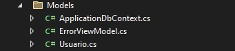

# Programação de Funcionalidades

Na elaboração do projeto para esta etapa, a aplicação web do Banco Municipal de Alimentos será estruturada no padrão MVC usando a plataforma Asp.NET Core. A aplicação será desenvolvida com base no princípio de separação de interesses, a qual será dividida em três camadas: Model, Controller e View. Assegurando assim, o baixo acoplamento e facilidade dos testes, no processo de desenvolvimento da aplicação.

# Login

Para esta fase inicial do projeto seguiremos com o requisito funcional RF-01 (Permitir que o usuário faça login de entrada). Na qual será criada uma tela de login de Usuário implementando a funcionalidade de acesso e permanência no sistema, tabém como a possibilidade de logout.

**Estrutura**

Na camada Controller, que será responsável pelo gerenciamento das requisições do sistema, o arquivo criado foi o UsuárioController.cs. Onde está inserido o código do CRUD e da validação de usuário e senha para login no sistema, bem como a criptografia para manutenção da segurança dos dados.

Código fonte presente no UsuáriosController.cs, para validação de Matrícula e Senha do usuário e permanência no sistema:

            if(user == null)
            {
                ViewBag.Message = "Usuário e/ou Senha inválidos!";
                return View();
            }

            bool senhaOk = BCrypt.Net.BCrypt.Verify(usuario.Senha, user.Senha);

            if (senhaOk)
            {
                var claims = new List<Claim>
                {
                  new Claim (ClaimTypes.Name, user.Nome),
                  new Claim (ClaimTypes.NameIdentifier, user.Nome),
                  new Claim (ClaimTypes.Role, user.Perfil.ToString())
                };

                var userIdentity = new ClaimsIdentity(claims, "login");

                ClaimsPrincipal userPrincipal = new ClaimsPrincipal(userIdentity);  

                var props = new AuthenticationProperties
                {
                    AllowRefresh = true,
                    ExpiresUtc = DateTime.Now.ToLocalTime().AddDays(1),
                    IsPersistent = true,

                };

                await HttpContext.SignInAsync(userPrincipal, props);

                return Redirect("Logado");
             
            }

            ViewBag.Message = "Usuário e/ou Senha inválidos!";
            return View();
        }

Para a camada Model geramos o ApplicationDbContext.cs, que cria uma classe de contexto para configurar o banco de dados. E também o arquivo Usuario.cs, onde ocorre a configuração dos modelos do banco de dados dos usuários, com a tabela (Usuários) e seus atributos (Cpf, Nome, Matrícula, Senha e Perfil). Nessa camada, a lógica de negócio é executada ocorrendo a persistência do estado e dos dados no sistema.

Código fonte referente ao arquivo Usuario.cs:

    [Table("Usuarios")]
    public class Usuario
    {
        [Key]
        public int Cpf { get; set; }

        [Required(ErrorMessage = "Campo obrigatório!")]
        public string Nome { get; set; }

        [Required (ErrorMessage ="Campo obrigatório!")]
        public string Matricula { get; set; }

        [Required (ErrorMessage ="Campo obrigatório!")]
        [DataType(DataType.Password)]
        public string Senha { get; set; }

        [Required (ErrorMessage ="Campo obrigatório!")]
        public Perfil Perfil { get; set; }
    }

    public enum Perfil
    {
        Admin,
        User
    }

Já na camada View responsável pela exibição do conteúdo da Interface do usuário, encontram-se os arquivos da Home da aplicação, Login.cshtml e a página acessada com senha, possibilitando o logout do usuário. Nessa camada os artefatos gerados são arquivos de marcação de texto, HTML. Nela ocorre o envio e a renderização das informações para o modelo através do controle. 

Tela final da sessão de Login do Usuário:

> **Links Úteis**:
>
> - [Trabalhando com HTML5 Local Storage e JSON](https://www.devmedia.com.br/trabalhando-com-html5-local-storage-e-json/29045)
> - [JSON Tutorial](https://www.w3resource.com/JSON)
> - [JSON Data Set Sample](https://opensource.adobe.com/Spry/samples/data_region/JSONDataSetSample.html)
> - [JSON - Introduction (W3Schools)](https://www.w3schools.com/js/js_json_intro.asp)
> - [JSON Tutorial (TutorialsPoint)](https://www.tutorialspoint.com/json/index.htm)
